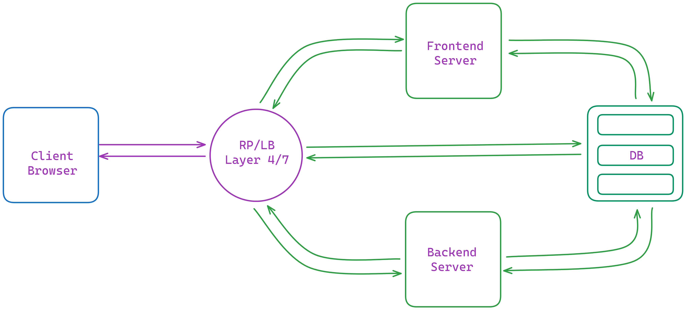

# Contactify: Containerized A Full Stack Contact Management Application Build by React Frontend and Python API Backend with Connectivity

Welcome to my Containerized React Frontend and Python API Backend with Connectivity repository! This project demonstrates the containerization of a React frontend application and a Python API backend application using Docker. The focus here is on containerization using Docker, showcasing connectivity between the two applications.

## Overview

I'm showcasing how I containerize both the React frontend and Python API backend applications using Docker, as well as how to establish connectivity between them.

### Project Architecture

<figure > 
<p align="center">
  
  <p align="center">Project Architecture</p> 
</p>
</figure>

## Features

- **Create Contacts**: Easily create new contacts by providing basic information such as first name, last name, and email address.
- **Edit Contacts**: Update existing contacts with new information or make corrections as needed.
- **Delete Contacts**: Remove unwanted contacts from your list effortlessly.
- **Browse Contacts**: View a list of all contacts stored in the application's database.

## Technologies Used


**Backend Application (Python API):**
- Simple Python API built with Flask
- **Flask**: A lightweight Python web framework used to build the backend API for handling contact management operations.
- **Flask-RESTful**: An extension for Flask that adds support for quickly building REST APIs.
- **SQLAlchemy**: A SQL toolkit and Object-Relational Mapping (ORM) library for Python, used for interacting with the application's database.
- **SQLite**: A lightweight relational database management system, used as the database backend for storing contact information.
- Containerized with Docker


**Frontend Application (React):**
- **React.js**: A JavaScript library for building user interfaces, used to create the interactive frontend of the application.
- **react-router-dom**: For routing within the React application, enabling navigation between different views or components.
- **Axios**: A promise-based HTTP client for making API requests from the frontend to the backend server.
- Containerized with Docker
- Served using an Nginx server


## File Structure

The project directory structure is organized as follows:

```
Contactify-App/
├── backend/
│   ├── config.py
│   ├── models.py
│   ├── app.py
│   └── Dockerfile
├── frontend/
│   ├── public/
│   │   │── favicon.ico
│   │   └── logo.png
│   ├── src/
│   │   │
│   │   │── App.css
│   │   │── App.jsx
│   │   │── ContactForm.jsx
│   │   │── ContactList.jsx
│   │   │── index.css
│   │   └── main.jsx
│   ├── index.html
│   └── Dockerfile
├── Docker-compose.yml
└── README.md
```

### Connectivity Between Frontend and Backend

I utilize Docker Compose to demonstrate connectivity between the frontend and backend applications.

### Implement Reverse Proxy

For enhanced functionality and security, I have implemented a reverse proxy like Nginx to act as a gateway between the frontend and backend applications.

## Instructions for Local Setup
To run Contactify locally, follow these steps:

1. Clone the repository:
   ```
   git clone https://github.com/TheToriqul/Contactify-App.git
   cd contactify
   ```

2. Run the backend server:
   ```
   cd backend
   pip install -r requirements.txt
   python app.py
   ```

3. In a new terminal window, run the frontend server:
   ```
   cd frontend
   npm install
   npm run dev
   ```

4. Open your web browser and navigate to `http://localhost:3000` to access the Contactify application.

- **Notes**
    - This application assumes that there is a backend server running at `http://localhost:5000` which provides an API endpoint for managing contacts.
    - Ensure that your backend server is properly configured and running before using this application.

## Instructions for Containerization

1. Clone my repository:

    ```bash
    git clone https://github.com/TheToriqul/Contactify-App.git
    ```

2. Navigate to the project directory:

    ```bash
    cd Contactify-App
    ```

3. Build and run the Docker containers using Docker Compose:

    ```bash
    docker-compose up --build
    ```

4. Access my Containerized React Frontend and Python API Backend with Connectivity in your browser:

    ```
    http://localhost:3000
    ```

## Dockerfiles

### Backend Dockerfile (./backend/Dockerfile)

My Backend Dockerfile starts with a Python Alpine base image, sets the working directory to `/app`, copies `requirements.txt`, installs Python dependencies, copies the application code, exposes port `5000`, and sets the command to run the Flask application.

### Frontend Dockerfile (./frontend/Dockerfile)

My Frontend Dockerfile sets up a build environment using a Node Alpine base image, sets the working directory to `/app`, copies all files, installs dependencies, and builds the React application. Then, it uses an Nginx Alpine base image, sets the working directory to serve static files, and copies the built files. It exposes port `3000`.

- **Notes**
    - Ensure that Python and Node.js are installed on your machine before running the application.
    - The backend server runs on port 5000 by default, while the frontend server runs on port 3000.
    - Modify the backend API endpoint in the frontend's Axios requests if the backend server is hosted elsewhere.

## Conclusion

By following my instructions, you can containerize both the React frontend and Python API backend applications using Docker. Additionally, you can demonstrate connectivity between the two applications within Docker containers. Optionally, you can implement a reverse proxy for enhanced functionality and security.

Feel free to reach out if you have any questions or need further assistance! 🚀
